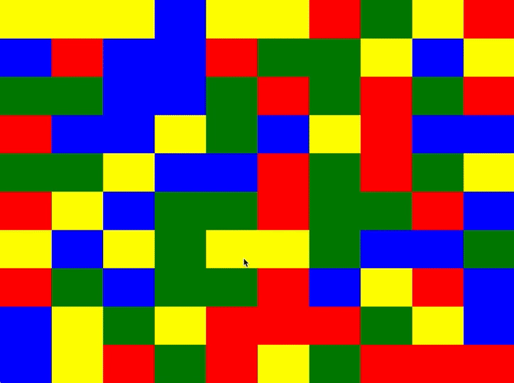

# "Blockchain" Puzzle

## To get started

```sh
npm i
# or yarn
npm start
# or yarn start
```

`http://localhost:9100/` will open automatically on the blockchain app, live-reloading as you develop.

`yarn test` & `yarn test:watch` to run the unit tests on the terminal.

## Task

Implement `blockClicked` to remove (or hide) all blocks of the same colour that are connected to the target element (block chain), then allow the blocks above the removed to "fall down" (similar to Tetris but you should click a block to have connected blocks removed, and the price of bitcoin).

## Thought Process

I tried to get this done only using the [HTMLCollections](https://developer.mozilla.org/en-US/docs/Web/API/HTMLCollection) API. Perf tests were basically the same as far as I can tell.

## Result


